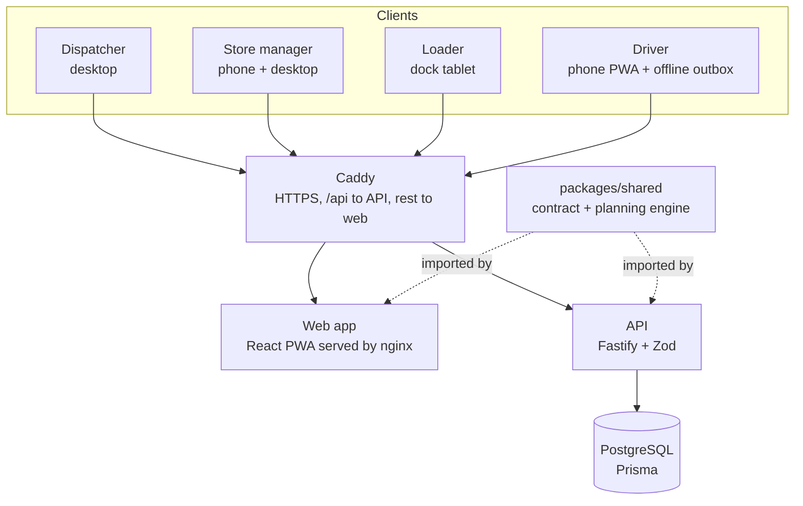
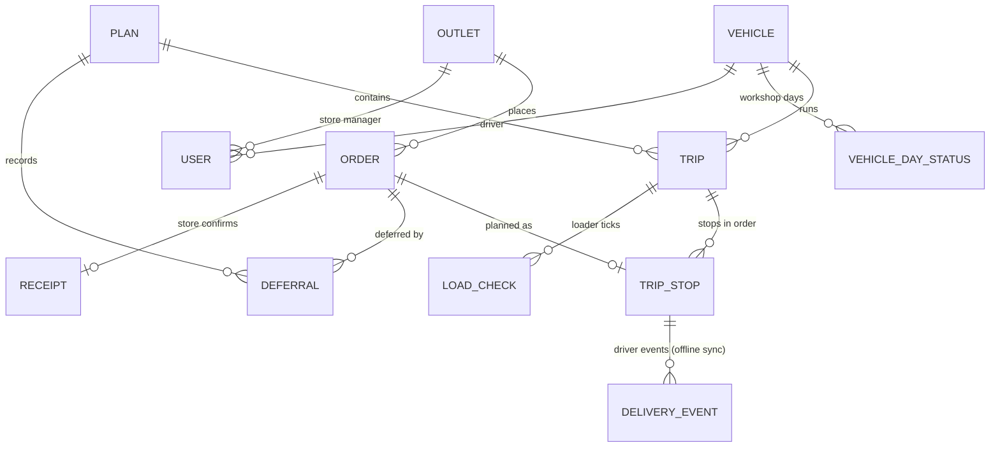

# Architecture

- One HTTPS domain. Every API route lives under `/api`.
- The planning engine is plain TypeScript with no dependencies: the browser uses it for instant rule checks while dragging, the API uses it to suggest and re-validate plans.
- The driver app saves every action to IndexedDB first and syncs to `/api/sync/events`; the server ignores repeated event ids, so retries are safe.

# Data model

Full definitions: `prisma/schema.prisma`.
