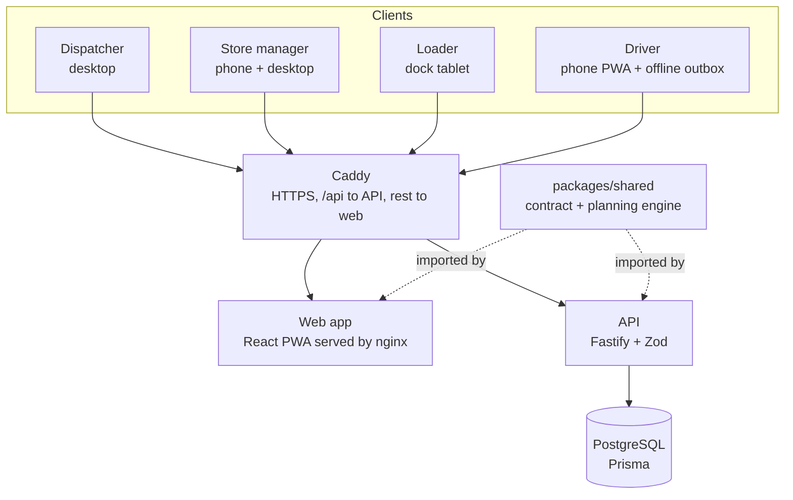
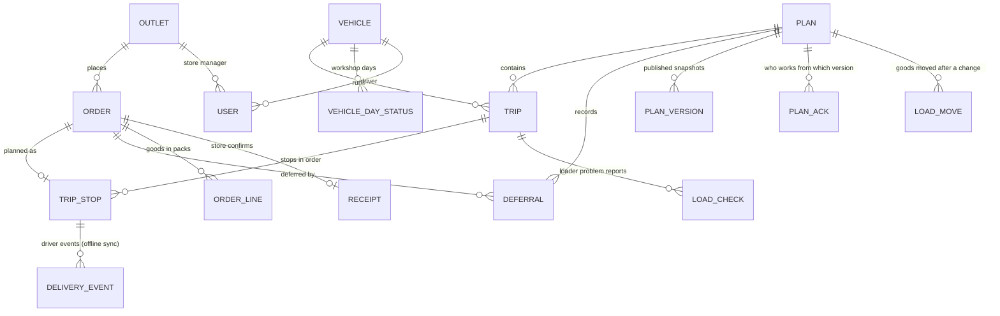

# Architecture



- One HTTPS domain. Every API route lives under `/api`.
- The planning engine is plain TypeScript with no dependencies: the API uses it to suggest plans, check every drag-and-drop (`/api/plans/check-placement`), re-validate whole plans and build the timetable (stop order and ETAs).
- The driver app saves every action to IndexedDB first and syncs to `/api/sync`; the server ignores repeated event ids, so retries are safe.
- Server-Sent Events (`/api/events`) push changes to the dispatcher screens; Caddy is set not to buffer them.

## Offline sync (driver)

```mermaid
sequenceDiagram
  participant Phone as Driver phone
  participant IDB as IndexedDB (route + outbox)
  participant API as API /api/sync
  participant DB as PostgreSQL
  Phone->>IDB: action → event {uuid, type, time}; apply to cached route
  Note over Phone,IDB: works with no signal
  Phone->>API: when online: POST events in order
  API->>DB: skip event ids already stored, apply the rest
  API-->>Phone: accepted / duplicates / rejected + current plan version
  Phone->>IDB: remove sent events
  Phone->>API: newer plan version? GET /api/driver/route
  Phone-->>Phone: show "Back online" (what was sent, what changed)
```

## Plan versions

Every publish stores a snapshot (`PlanVersion`). Loaders see the difference between the version they acknowledged and the current one (L4), mark goods as moved (`LoadMove`) and acknowledge (`PlanAck`). Drivers acknowledge by departing. Sealed and departed trips are locked against edits.

## Store manager loop

Every `/api/store/*` route is scoped to the signed-in manager's outlet. Orders are built from the goods catalogue (`storeOrderLines` in `packages/shared/src/goods.ts`), so the store, the loader and the driver count the same packs; they can be edited until the 16:00 cutoff. A store sees a deferral only after the plan is published, with the reason in plain words, and can accept the new day or cancel. The order page combines the plan (ETA from the trip timetable), driver events (lateness, proof of delivery) and the loader's short packs. Confirming receipt line by line writes a `Receipt`; any short or damaged line raises a *Store issue* alert on the dispatcher's Live Tracking.

# Data model



Full definitions: `prisma/schema.prisma`.
